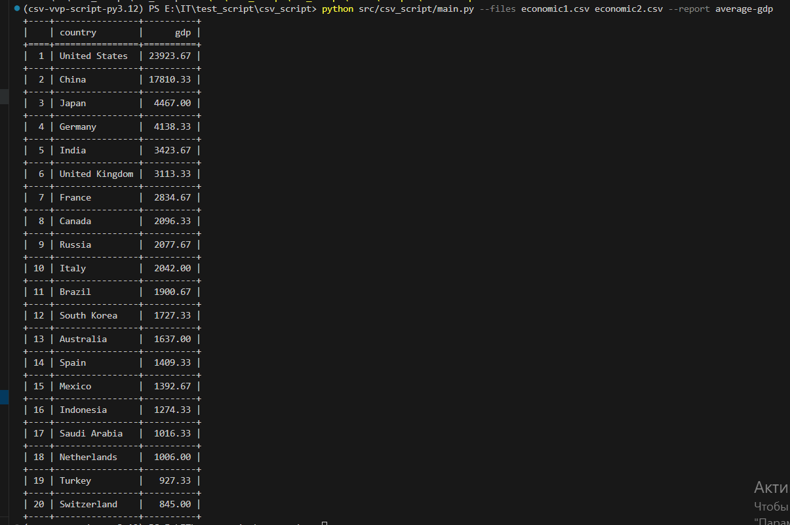

# CSV Script

Приложение для генерации экономических отчётов из CSV-файлов.

## Описание

Проект предоставляет расширяемую систему для обработки CSV-файлов с экономическими данными и генерации различных отчётов. Архитектура основана на реестре отчётов, что позволяет легко добавлять новые типы отчётов без изменения основного кода.
Чтобы добавить новый отчёт:
1. Создать файл reports/my_report.py с функцией, обёрнутой в @register("my-report").
2. Добавить в __init.py__  строку: from . import my_report

## Установка

```bash
# Установка зависимостей через poetry
poetry install

```

## Использование

```bash
poetry run python src/csv_script/main.py --files dataset1.csv dataset2.csv --report average-gdp
```

### Пример вывода




## Разработка

```bash
# Запуск тестов
poetry run pytest

# Запуск тестов с покрытием кода
poetry run pytest --cov=src/csv_script --cov-report=html
